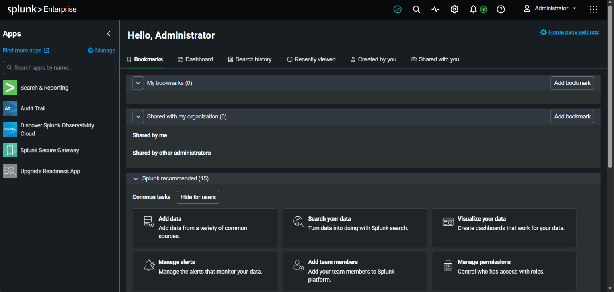
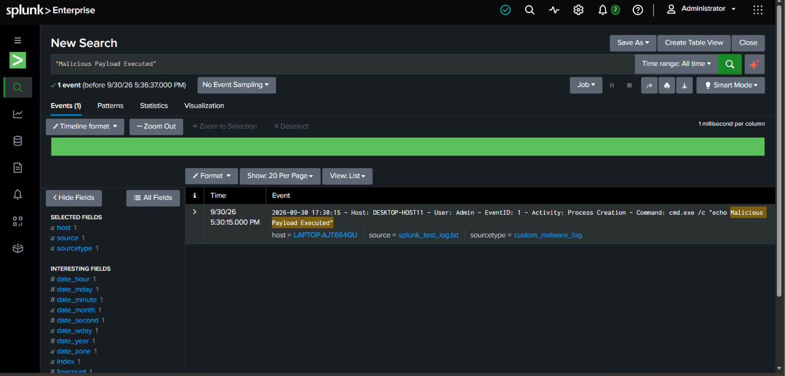

# Project: SIEM Analytics & Threat Hunting via Splunk Enterprise

## Executive Summary
This project demonstrates an on-premise SIEM deployment, data engineering pipeline, and incident threat hunting lifecycle using Splunk Enterprise. To evaluate data ingestion and parsing workflows within an optimized architectural framework, I indexed unstructured local endpoint text telemetry, mapped the data to a tailored schema, and authored search strings using Splunk Search Processing Language (SPL) to actively isolate hidden indicators of compromise (IOCs).

## SIEM Configuration Metrics
* **SIEM Platform:** Splunk Enterprise (Localhost Core Instance Architecture)
* **Ingested Log Source:** Host Endpoint Threat Execution Log (`splunk_test_log.txt`)
* **Custom Source Type Mapping:** `custom_malware_log`
* **Query Language Execution:** Splunk SPL (Search Processing Language)
* **Target Hunting Indicator:** `"Malicious Payload Executed"`

---

## Technical Walkthrough & Evidence

### 1. SIEM Infrastructure Verification
The Splunk Enterprise server instance was successfully configured on the host machine environment to serve as the core centralized logging clearinghouse and analytical console for incoming system event data.

*Figure 1: On-premise Splunk administrative console landing interface panel.*

### 2. Data Indexing & Tailored Schema Mapping
The raw host endpoint logging string was ingested directly into the Splunk indexing engine. During the data definition phase, a custom sourcetype boundary rule framework (`custom_malware_log`) was created to properly map the timeline, system user privileges, and execution attributes.

### 3. Threat Hunting & SPL Query Validation
Using precision Splunk SPL query parameters (`"Malicious Payload Executed"`), I scanned the indexed repository to pull down explicit security indicators. Splunk's parsing engine successfully caught the log, isolated the `EventID: 1` metadata fields, and highlighted the payload command execution strings inside the timeline console view.

*Figure 2: Active Splunk query environment identifying anomalous process strings inside security datasets.*

---

## Analytical Conclusions & Mitigation Playbook
1. **Telemetry Normalization:** The successful parsing of the custom text data string proves that manual text-matching ingestion parameters can accurately categorize host logs without crashing system memory pools.
2. **SOC Operational Recommendations:**
   * Build real-time correlation alerts inside Splunk to flag common administrative parent processes (`cmd.exe /c`, `powershell.exe -EncodedCommand`) when executed outside standard maintenance hours.
   * Standardize the ingestion of all endpoint process create data logs to quickly establish host visibility timelines during a network incident investigation.
